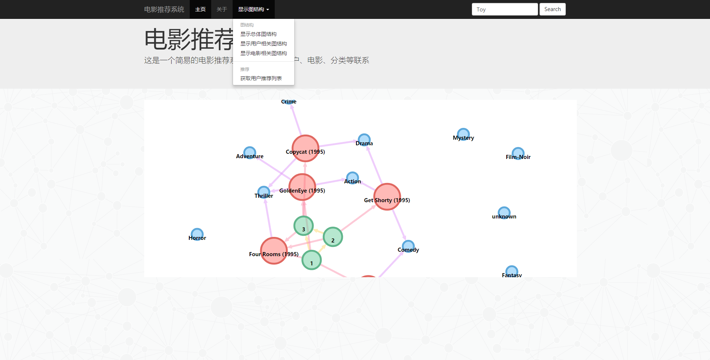

# movie-recommendation-demo

### Prerequisites

1. [maven][maven]
2. [bower][bower]

### How to run

1. git clone https://github.com/liudonghua123/movie-recommendation-demo.git
2. cd movie-recommendation-demo
3. bower install
4. mvn spring-boot:run
5. navigate http://localhost:1234/

### What's the date used

I used a really samll-sized and simplified of [MovieLens][MovieLens] which contains only 3 users, 5 movies, 19 genres and 8 user-movie relationships. See `other/neo4j-data-importer/resources/ml-100k-sm` for detial data.

You can regenerate the data and copy to replace `resources/database_movie_recommend_neo4j.db`, see `other/neo4j-data-importer` for more details on how to generate the data.

### Snapshot

### License

The MIT License (MIT)

[maven]: http://maven.apache.org/guides/getting-started/maven-in-five-minutes.html
[bower]: https://bower.io/
[MovieLens]: https://grouplens.org/datasets/movielens/
